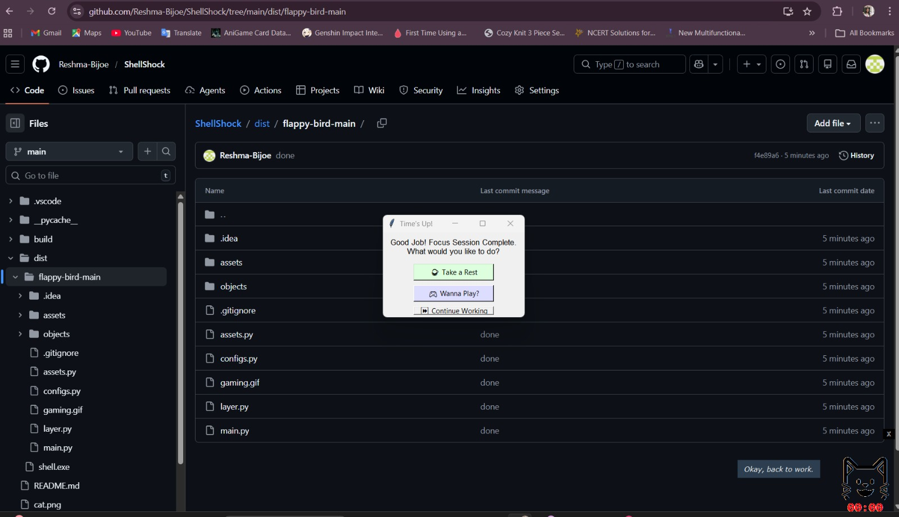
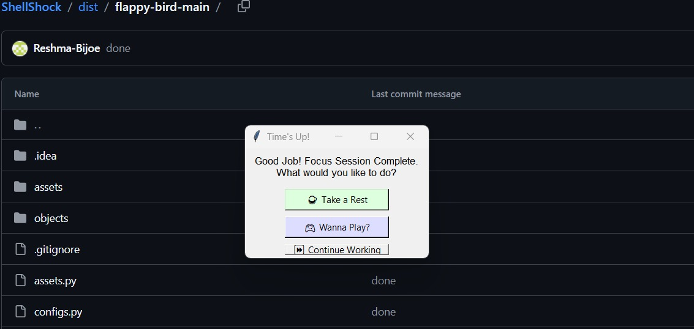
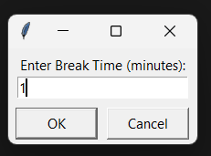
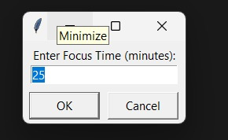
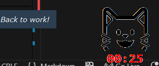
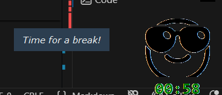
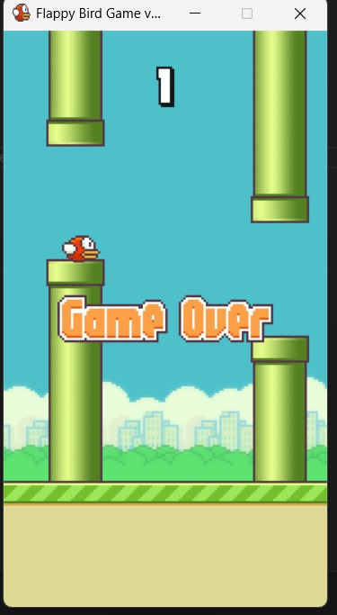
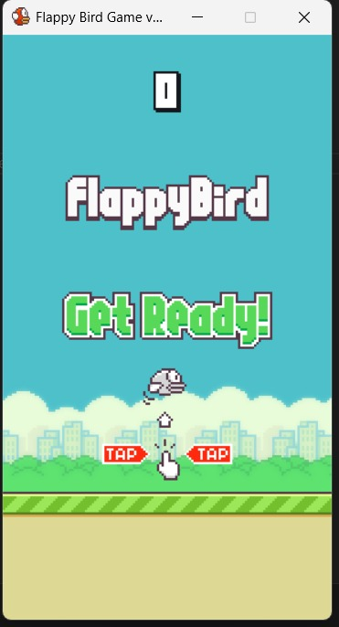
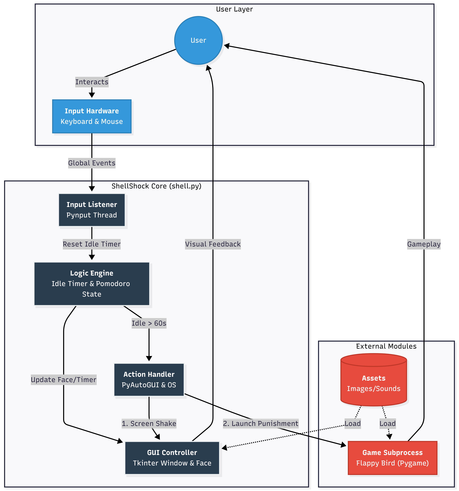
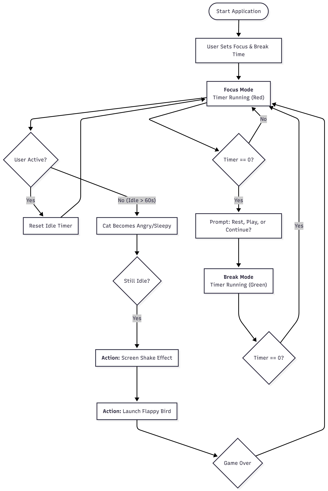

[ShellShock] 🎯
Basic Details

Team Name: [Coffee and Code]

Team Members:
Member 1: [Nayana Binu] - [Scms School of engineering and technology]
Member 2: [Reshma Bijoe] - [Scms School of engineering and technology]

Project Description :
ShellShock is a semi-sentient, passive-aggressive desktop companion that lives on your screen to manage your productivity. It’s not just a pet; it’s an OS-aware assistant that roasts your distractions, compliments your "deep work," and forces you into high-intensity "micro-breaks" via an integrated Flappy Bird-style game.

The Problem statement
In an era of remote work and complex coding, developers fall victim to two main productivity killers:

* *The "Stare-Down":* Getting stuck on a bug and staring at the screen for 20 minutes without a single mouse move (Analysis Paralysis).
* *The "Social Media Rabbit Hole":* Taking a "quick break" on YouTube or Reddit that accidentally lasts two hours because there’s no "hard stop."
* *Dry Productivity Tools:* Standard Pomodoro timers are easy to ignore and lack the personality needed to actually engage a developer.

The Solution :
solves this by providing a "Human-In-The-Loop" desktop experience:

1. *Context-Aware Personality:* It uses system-level window tracking to know if you are in VS Code (Compliments) or YouTube (Insults).
2. *Inactivity Intervention:* If you don't move your mouse for a set time, the pet *physically shakes your screen* ("knocking") to wake you up.
3. *The Gamified Circuit Breaker:* It provides a 60-second "Focus Game" that is intense enough to reset your brain but short enough to keep you on track. The game *force-closes itself* when the timer ends to push you back into your IDE.

Technical Details :

Technologies/Components Used

For Software:

Languages used: [Python]
Frameworks used: [Tkinter,Pygame]
Libraries used: [Pillow (PIL),PyAutoGUI,Pynput,Sys & OS,Threading]
Tools used: [e.g., VS Code, Git, PyInstaller]

Features:

List the key features of your project:

Feature 1: Interactive Desktop Companion
A floating, "always-on-top" GUI widget (represented by a cat emoji) that provides real-time visual feedback. The companion changes its expression (Happy 😺, Sleepy 😴, Angry 🛑, Cool 😎) based on your current productivity status and focus mode.

Feature 2: Smart Activity Monitoring
Uses background input listeners (via pynput) to track mouse movements and keyboard presses. It detects when you are idle for too long (e.g., 60 seconds) and triggers reactions like a "screen shake" effect or visual alerts to nudge you back to work.

Feature 3: Customizable Focus Timer
Implements a Pomodoro-style timer system that allows users to set custom "Focus" and "Break" durations. The interface changes color (Red for Focus, Green for Break) to indicate the current mode and manages the transition between working and resting.

Feature 4: Gamified "Punishments" & Breaks
Integrates a full "Flappy Bird" clone (located in flappy-bird-main). This game is launched automatically as a "punishment" for severe distraction or offered as an optional leisure activity when a scheduled break begins.

*Implementation *:
For Software:
Installation
 # Clone the repository
git clone https://github.com/Reshma-Bijoe/ShellShock/

# Navigate to the directory
cd shellshock

# Install dependencies
pip install -r requirements.txt

Run
# Run the main application
python shell.py

*SCREENSHOTS* :

*System Architecture* :

Diagram
 

User Input: The system starts with the user interacting with their Keyboard & Mouse.

Input Listener: The Pynput module runs in a background thread, silently intercepting these global events to track when the user is active without interfering with their work.

Logic Engine:

Idle Monitor: Constantly compares the last activity timestamp against the current time. If the difference exceeds the limit (e.g., 60s), it flags the user as "Distracted".

Pomodoro Timer: Runs the countdown logic for Focus and Break sessions.

GUI Controller: The main Tkinter thread updates the "Cat" avatar's emotions (Happy 😺 / Angry 🛑) and the timer display based on signals from the Logic Engine.

Action Handler:

Screen Shake: If ignored, PyAutoGUI takes a screenshot and shakes it to visually "nudge" the user.

Game Launcher: If the user fails a session or enters a break, the system uses the subprocess module to spawn a completely separate process for the Flappy Bird game.

Application Workflow Diagram
This diagram explains the step-by-step flow of how a user interacts with ShellShock, from setting the timer to handling the game punishment.

Code snippet

*App Flow Description* :
Startup: User sets "Focus Time" and "Break Time" (e.g., 25min / 5min).

Focus Phase: - The Cat Widget floats on top of all windows.
    Timer counts down in Red.
    Application monitors mouse/keyboard.
    If Idle: Screen shakes, Cat gets angry.

Completion: - Timer hits 00:00.
    User is prompted: "Rest", "Play Game", or "Continue".

Break Phase:
    Timer counts down in Green.
    User can play Flappy Bird or relax.
    Cat wears sunglasses (Cool Mode).

*Project Demo :*

Video
Link : https://drive.google.com/file/d/15sX4NM6y57oXQ6nNDbLWIRxLmRZh5r7K/view?usp=drivesdk
A walkthrough demonstrating the focus timer setup, the idle detection (screen shake), and the transition into the Flappy Bird game.

*Team Contributions :*

1.Nayana Binu: Game Integration, Assets & Build

Integrated the Flappy Bird game engine (pygame) and handled the subprocess communication between the main app and the game.

Managed all visual assets (pixel art sprites for the pet and game).

Configured the PyInstaller build process to ensure the .exe works with external game files and wrote the project documentation.

2.Reshma Bijoe: Core Application & Logic

Developed the main shell.py GUI framework using tkinter.

Implemented the background multi-threading for the pynput idle detection system.

Coded the Pomodoro timer logic, state management (Focus vs. Break), and the "Screen Shake" punishment mechanism.

